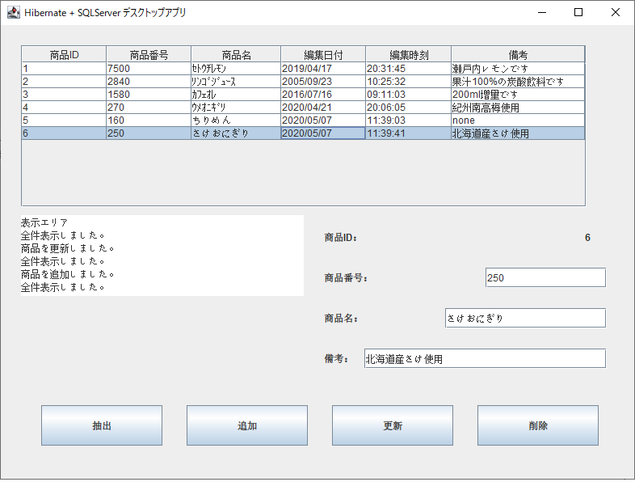

### :computer: SwingデスクトップアプリでHibernateを使いSQLServerとの読み書きサンプル
___

### 環境
```
開発環境：Eclipse 2020-12 R(4.18.0) Pleiades  
言語：Java 11
デベロッパーSDK：Adopt OpenJDK 11.0.10 + 9
データベース：Microsoft SQLServer 2019 Express CU8(21/01/12)  
データベース接続：Microsoft JDBC Driver 9.2.0 for SQL Server  
-データベース管理ツール：Microsoft SQL Server Management Studio 18.8  
O/R マッパー フレームワーク：Hibernate ORM 5.4.27 Final
```



## 事前準備  
### サンプルプログラムを実行する際のデータベース作成  
Microsoft SQL Server Management Studioのクエリーで以下を実行するかこれ相当をデザイナで作成します。  

#### データベース作成(Microsoft SQL Server ManagementStudioでのデフォルト相当)  
※Microsoft SQL Server 2019 Express Editionで名前付きインスタンスが`SQLEXPRESS`の場合のクエリーです。  
別のインスタンス名やSQL Server 2017などのバージョンの場合はPathの**MSSQL15.SQLEXPRESS(ディレクトリ名)**  
が違いますのでご自身のディレクトリ名に合わせて下さい。  
```
use [master]
CREATE DATABASE HibernateSample
ON
(NAME=JdbcSample,FILENAME='C:\Program Files\Microsoft SQL Server\MSSQL15.SQLEXPRESS\MSSQL\DATA\JdbcSample.mdf',SIZE=8MB,FILEGROWTH=64MB)
LOG ON
(NAME=HibernateSample_log,FILENAME='C:\Program Files\Microsoft SQL Server\MSSQL15.SQLEXPRESS\MSSQL\DATA\HibernateSample_log.ldf',SIZE=8MB,FILEGROWTH=64MB)
	
ALTER DATABASE HibernateSample SET AUTO_CLOSE OFF
```

#### テーブル作成およびサンプルデータ  
Hibernateの機能および設定によりテーブルが無ければ作成しますので必要ありません。  
サンプルデータもプログラムでデータが１件も無ければ作成する様になっていますので必要ありません。  

#### SQL Server Configuration Manager  
SQL Server Browserの実行とTCP/IPの有効を適用して下さい。  

___